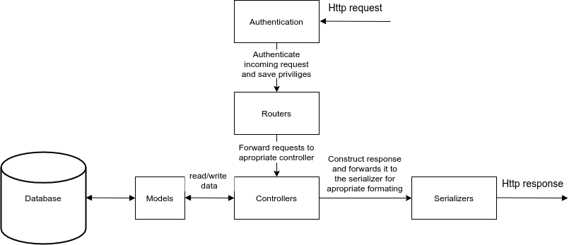

# Test aggregator

## Problem and Importance

Fluidpay has a simulation tool over on it’s API that simulates the users behaviour to test the correctness of the API and make sure future development in the API doesn’t break anything. This is an aggregator tool, the purpose of which is to get the results of these tests, save them properly into a database (MySQL) and visualize on the front side.

## Usage

### Backend

You might need to use sudo with the docker commands.

Type this in your terminal

export NODE_ENV=production

#### First startup

Type in your terminal

[`docker-compose exec theta-test-aggregator sh `]

In this window type in the following

[`npm install`]

[`npm run db:migrate`]

### Frontend

#### First startup

Navigate to the frontend folder in your terminal, then type in

[`npm install`]

#### Every startup

Navigate to your frontend folder in your terminal, then type in

[`ng build --watch`]

Do not close the terminal after it started succesfully.

Now you can see it in action in your browser on [`http://localhost:4200`].

## Design

This project contains 3 essential parts:

- A MYSQL database that recieves / updates and stores data about incoming test results and users.

- Express js for the backend logic.

- An Angular frontend as an interface for users.

### Express structure

The backend structure is divided into different modules, which are the following:

- Routers to forward the supported requests (and any information in request URLs and body) to the appropriate controller functions.

- Controller functions to get or modify the requested data from the database through the models.They also construct unformatted HTTP responses.

- Serializers format the HTTP response to the appropriate scheme.

- Middlewares handling authentication, authorization and many integral parts of the project.

## Development

This test aggregator was developed using Docker, Express js on the backend, and Angular on frontend.

To develop a new feature you would first start up the backend with the [`docker-compose up`] command in the backend folder.

You open a new terminal window and navigate into the frontend folder and use the [`ng serve`] command.

If your feature requires a new npm module on the backend side, you'd first open a new terminal window and type in

[`docker-compose exec thet-test-aggregator sh `]

and install your npm module in here.

After saving any changes on the backend docker should restart automatically and inform you of any errors while running.If this doesnt happen, you can manually restart docker by pressing [`Ctrl + C`] and typing in [`docker-compose up`] again.

If your feature requires a new npm module on the frontend side, you'd install that in the frontend folder directly.

After saving any changes on the frontend there should be an automatic restart that should inform you of any error encountered.If this doesnt happen, you can manually restart by pressing [`Ctrl + C`] and typing in [`ng serve`] again.
