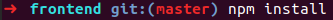

# Test aggregator

## Problem and Importance

Fluidpay has a simulation tool over on it’s API. That simulates the users behaviour to test the correctness of the API and make sure future development in the API doesn’t break anything. This is an aggregator tool, the purpose of which is to get the results of these tests, save them properly into a database (MySQL) and visualize on the front side.

## Usage

### Backend

#### First startup

Navigate to the backend folder in your terminal, then type in

[`docker-compose up`]

Open a new terminal window and type in

[`docker-compose exec thet-test-aggregator sh `]

In this window type in the following

[`npm install`]
[`npm run db:migrate:all`]
[`npm db:seed`]

#### Every startup

Navigate to the backend folder in your terminal, then type in

[`docker-compose up`]

You might need to use sudo with the command.

Do not close the terminal after it started succesfully.

### Frontend

#### First startup

Navigate to the frontend folder in your terminal, then type in

[`npm install`]

Then continue with the usual startup in the next section.

#### Every startup

Navigate to your frontend folder in your terminal, then type in

[`ng serve`]

Do not close the terminal after it started succesfully.

## Design

This project contains 4 essnetial parts:

- A MYSQL database recieveing / updating all the incoming test results.

- A MYSQL database containing / updating / managing users.

- Express js for the backend logic.

- An Angular frontend as an interface for users.

## Development

This test aggregator was developed using Docker, Express js on the backend, and Angular on frontend.

To develop a new feature you would first start up the backend with the previously mentioned [`docker-compose up`] command in the backend folder.

If your feature requires a new npm module on the backend side, you'd install that in the backend folder directly.

After saving any changes docker should restart automatically and inform you of any errors while running.If this doesnt happen, you can manually restart docker by pressing [`Ctrl + C`] and typing in [`docker-compose up`] again.

If you are satisfied on the backend you navigate into the frontend folder and use the previously mentioned [`ng serve`] command.

If your feature requires a new npm module on the frontend side, you'd install that in the frontend folder directly.

After saving any changes there should be an automatic restart that should inform you of any error encountered.If this doesnt happen, you can manually restart by pressing [`Ctrl + C`] and typing in [`ng serve`] again.
